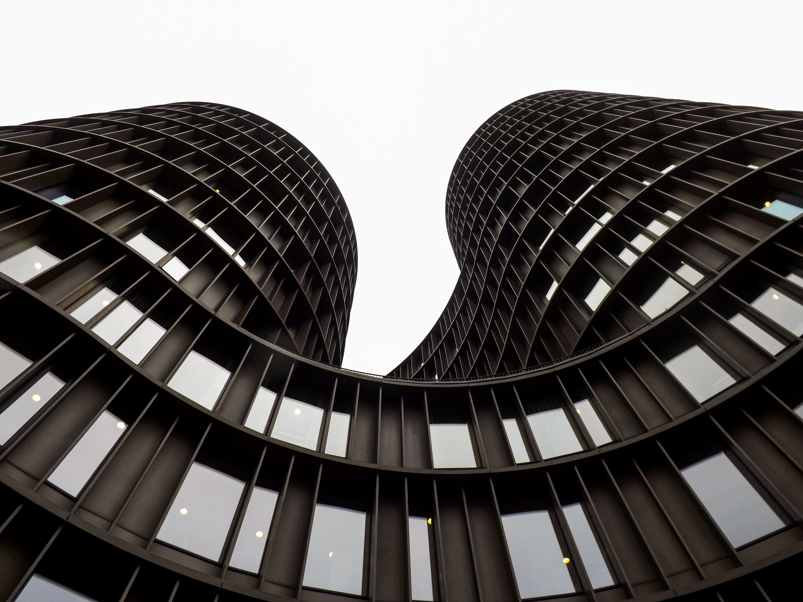

## Mozjpeg procession

```
Benchmark 1: squoosh-cli --mozjpeg '{quality:50}' -d ../squoosh ./boliviainteligente-JUtc5Lu4BCQ-unsplash.jpg
  Time (mean ± σ):      4.186 s ±  0.041 s    [User: 5.634 s, System: 0.413 s]
  Range (min … max):    4.152 s …  4.284 s    10 runs

Benchmark 2: rimage -q 50 -o ../rimage ./boliviainteligente-JUtc5Lu4BCQ-unsplash.jpg
  Time (mean ± σ):      1.512 s ±  0.036 s    [User: 1.461 s, System: 0.051 s]
  Range (min … max):    1.476 s …  1.582 s    10 runs

Summary
  rimage -q 50 -o ../rimage ./boliviainteligente-JUtc5Lu4BCQ-unsplash.jpg ran
    2.77 ± 0.07 times faster than squoosh-cli --mozjpeg '{quality:50}' -d ../squoosh ./boliviainteligente-JUtc5Lu4BCQ-unsplash.jpg
```

Original **JPG (1.47MB)**


Squoosh **JPG (462.86KB)**


Rimage **JPG (462.86KB)**


## Oxipng procession

```
Benchmark 1: squoosh-cli --oxipng '{level:2}' -d ../squoosh ./edwin-splisser-GC7FLmgU5Z4-unsplash.jpg
  Time (mean ± σ):     28.419 s ±  1.092 s    [User: 29.659 s, System: 0.669 s]
  Range (min … max):   27.795 s … 31.432 s    10 runs

  Warning: The first benchmarking run for this command was significantly slower than the rest (31.432 s). This could be caused by (filesystem) caches that were not filled until after the first run. You should consider using the '--warmup' option to fill those caches before the actual benchmark. Alternatively, use the '--prepare' option to clear the caches before each timing run.

Benchmark 2: rimage -f oxipng -o ../rimage ./edwin-splisser-GC7FLmgU5Z4-unsplash.jpg
  Time (mean ± σ):     10.862 s ±  0.679 s    [User: 13.256 s, System: 0.141 s]
  Range (min … max):   10.358 s … 12.169 s    10 runs

  Warning: Statistical outliers were detected. Consider re-running this benchmark on a quiet system without any interferences from other programs. It might help to use the '--warmup' or '--prepare' options.

Summary
  rimage -f oxipng -o ../rimage ./edwin-splisser-GC7FLmgU5Z4-unsplash.jpg ran
    2.62 ± 0.19 times faster than squoosh-cli --oxipng '{level:2}' -d ../squoosh ./edwin-splisser-GC7FLmgU5Z4-unsplash.jpg
```

Original **JPG (1.37MB)**



Squoosh **PNG (7.83MB)**


Rimage **PNG (7.84MB)**


## Webp procession

```
Benchmark 1: squoosh-cli --webp '{quality:50}' -d ../squoosh ./felix-rottmann-n-Ky-79zeXM-unsplash.jpg
  Time (mean ± σ):     50.785 s ±  2.291 s    [User: 52.350 s, System: 1.355 s]
  Range (min … max):   47.623 s … 54.083 s    10 runs

Benchmark 2: rimage -f webp -q 50 -o ../rimage ./felix-rottmann-n-Ky-79zeXM-unsplash.jpg
  Time (mean ± σ):     16.983 s ±  1.002 s    [User: 16.759 s, System: 0.214 s]
  Range (min … max):   15.479 s … 18.334 s    10 runs

Summary
  rimage -f webp -q 50 -o ../rimage ./felix-rottmann-n-Ky-79zeXM-unsplash.jpg ran
    2.99 ± 0.22 times faster than squoosh-cli --webp '{quality:50}' -d ../squoosh ./felix-rottmann-n-Ky-79zeXM-unsplash.jpg
```

Original **JPG (15.25MB)**


Squoosh **WEBP (7.33MB)**


Rimage **WEBP (7.33MB)**


## AVIF procession

```
Benchmark 1: squoosh-cli --avif '{cqLevel:32}' -d ../squoosh ./gustavo-zambelli-SIC3k8IMhhA-unsplash.jpg
  Time (mean ± σ):     21.446 s ±  1.270 s    [User: 119.643 s, System: 1.425 s]
  Range (min … max):   18.648 s … 23.048 s    10 runs

Benchmark 2: rimage -f avif -q 50 -o ../rimage ./gustavo-zambelli-SIC3k8IMhhA-unsplash.jpg
  Time (mean ± σ):      6.073 s ±  0.136 s    [User: 37.243 s, System: 0.182 s]
  Range (min … max):    5.865 s …  6.281 s    10 runs

Summary
  rimage -f avif -q 50 -o ../rimage ./gustavo-zambelli-SIC3k8IMhhA-unsplash.jpg ran
    3.53 ± 0.22 times faster than squoosh-cli --avif '{cqLevel:32}' -d ../squoosh ./gustavo-zambelli-SIC3k8IMhhA-unsplash.jpg
```

Original **JPG (4.71MB)**


Squoosh **AVIF (596.16KB)**


Rimage **AVIF (548.47MB)**


All images was taken from [Unsplash](https://unsplash.com/)
